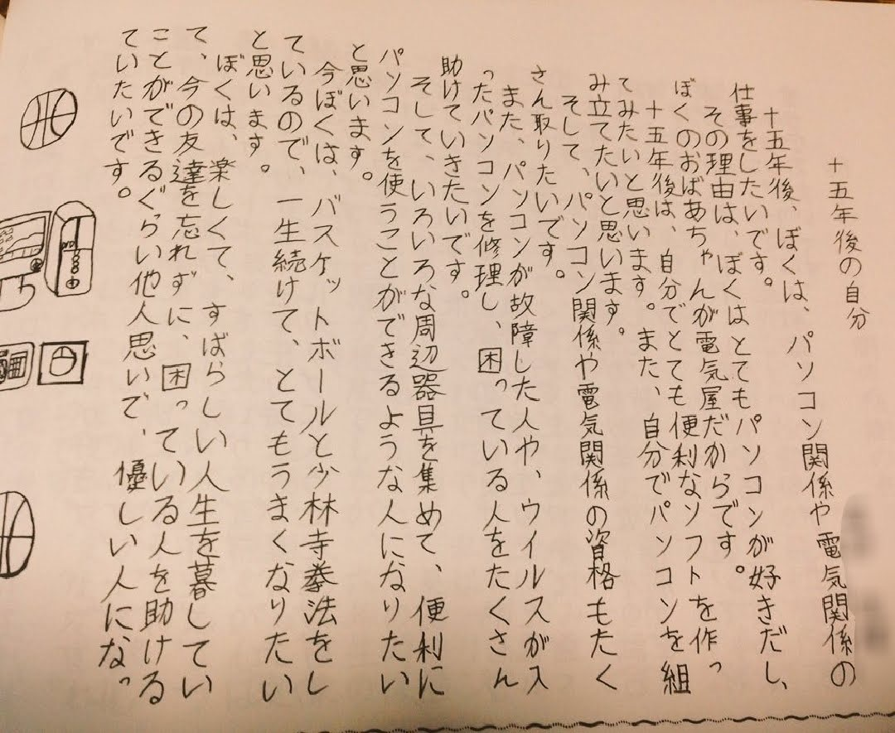

# Profile

Yuki-Kikuya (Security Specialist)

## Likes
* Motorcycle (`Ninja250 SE`)  
  
* Music(Drums)  
  
* Photo(Camera)   
  [portfolio](https://photo.mumvall.com/)

## Educational Background 
* 2012-2015 Osaka Prefectural Semboku Senior High School，泉北高校
* 2015-2016 Osaka Computer School，大阪情報専門学校
* 2018-2020 The Open University of Japan，放送大学
* 2021-2023 Hokkaido Infomation University，北海道情報大学

## Occupation
* 2017-2018 a software Engineer (`Softwere Constant Cooperation Co., Ltd`，株式会社SCC)
* 2018-2023 a teacher of College [computer science] (`Electonics Development College`，電子開発学園 大阪情報専門学校 教員)
* 2023-     a software Engineer (`Rivine Co., Ltd`，株式会社Rivine)

## Skills
* Security
* Education
* Finance
* Engineering

## Publishment
* [Photocatalysis of silver phosphate(2012)](doc/2012.pdf)

## Results and Products
* [Icewall Hello - FIDO2 authentication software](https://www.hpe.com/jp/ja/software/icewall/mfa/mfa-fido2.html)
* [Drinking Party - Video matching application](doc/2015.pdf)

## License
* High School Teaching Lisence(Business)- 高等学校教諭一種免許状(商業)(March 2023)
* High School Teaching Lisence(Infomartion)- 高等学校教諭一種免許状(情報)(March 2023)
* High School Teaching Lisence(Math)- 高等学校教諭一種免許状(数学)(March 2023)
* Teacher's certificate of College - 専修学校教員認定証(March 2021)
* Oracle Certified Java Programmer, Bronze SE 7/8(January 2020)
* Information Security Specialist - 情報処理安全確保支援士試験(June 2019)
* 2nd grade Certified Skilled Worker of Web Design - ウェブデザイン技能検定2級(May 2019)
* 3nd grade Certified Skilled Worker of Web Design - ウェブデザイン技能検定3級(April 2019)
* Financial Planning Exam - grade 3 - ファイナンシャルプランニング技能士 3級(May 2017)
* Accounting Exam grade 3 - 簿記検定 3級(November 2016)
* Amateur radio licensing grade 4 in Japan - 4級アマチュア無線技士(October 2016)
* Applied Information Technology Engineer Examination - 応用情報技術者試験(AP) (April 2016)
* Fundamental Information Technology Engineer Examination - 基本情報技術者試験(FE) (October 2015)
* English proficiency Test grade 2 - 実用英語技能検定2級(October 2015)
* Information Technology Passport Examination - ITパスポート(IP) (August 2015)

## categories of repos
### License
1. [ITPEC questions (translate lang='ja')](https://yuuyuu244.github.io/itpec-fe-trans-ja/)
2. [Jken](https://github.com/yuuyuu244/info-tech-cert-jken)
3. [FE](https://github.com/yuuyuu244/national-exam-fe8)

### apps
1. [DrinkingParty](https://github.com/yuuyuu244/DrinkingParty)
1. [image-scraping](https://github.com/yuuyuu244/image-scraping)
1. [stream-downloader](https://github.com/yuuyuu244/stream-downloader)

### Security

1. [sql-inject](https://github.com/yuuyuu244/sql-inject)

### math

1. [data-analysis](https://github.com/yuuyuu244/data-analysis)
2. [math-learning](https://github.com/yuuyuu244/math-learning)

### music

1. [musescore-programming](https://github.com/yuuyuu244/musescore-programming)

## links

* [mumvall.com](http://mumvall.com)
