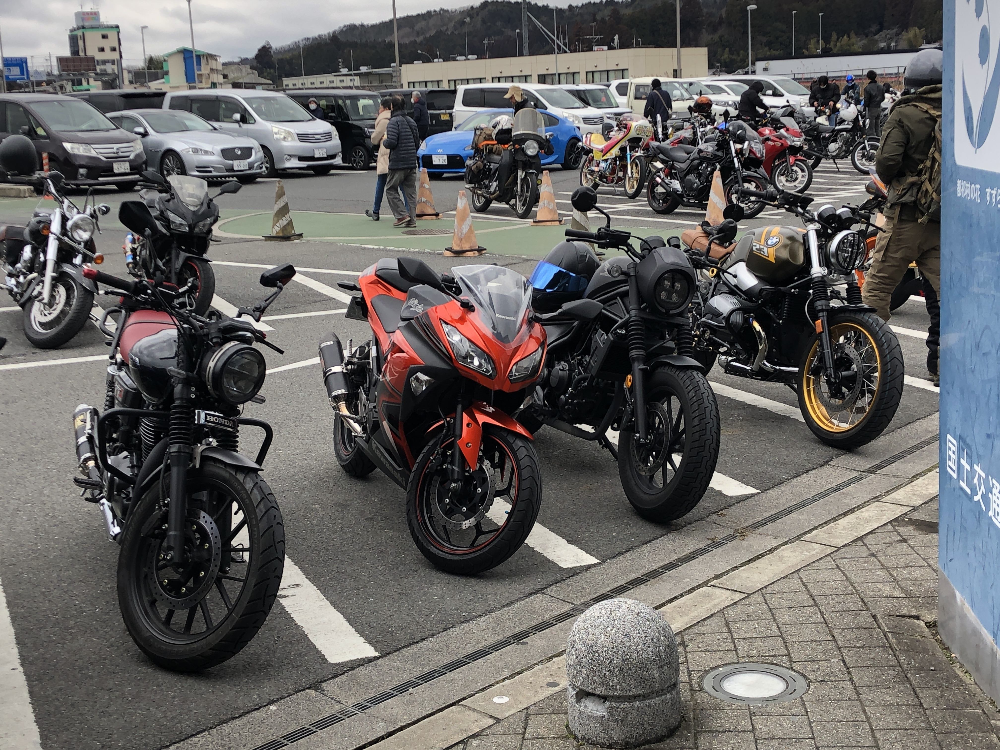

# 🎉 Profile

🛡️ Yuki-Kikuya 菊谷友暉 (Security Specialist, 情報処理安全確保支援士, 職業訓練指導員, 少林寺拳法2段)

📖 [2009 - graduation essay at elementary school]

**Graduation Essay - "Myself in Fifteen Years"**

In fifteen years, I want to work in the field of computers or electronics. The reason is that I really like computers, and my grandmother runs an electronics store. I also want to create useful software and try assembling computers myself. Moreover, I want to earn many certifications related to computers and electronics. I aim to help people by repairing broken computers or fixing ones infected with viruses. Additionally, I want to collect various peripherals, make them convenient, and cherish my current friendships throughout my life. I aspire to live a very enjoyable and wonderful life while becoming a kind person who can help those in need.

## ❤️ Likes

- 🏍️ Motorcycle (`Ninja250 SE`)\
  

- 🥁 Music(Drums)

- 📸 Photo(Camera)
  
  [portfolio](https://photo.mumvall.com/)

## 🌟 Personality

1. 😊 love **markdown** documents! dislike `microsoft Office`! please use text-based documents **for LLM** 😵!!
1. 😊 love `gh copilot`, `cursor`, **neovim**! dislike `emacs` 😵!!

## 🎓 Educational Background

- 2012-2015 `Osaka Prefectural Semboku Senior High School`，泉北高校, GPA：4.6/5.0
- 2015-2016 `Osaka Computer School`，大阪情報専門学校
- 2018-2020 `The Open University of Japan`，放送大学 教養学部 教養学科 情報コース, GPA：3.2/4.0
- 2021-2023 `Hokkaido Information University`，北海道情報大学, GPA：3.4/4.0
- 2024-2026 `The Open University of Japan`，放送大学 教養学部 教養学科 心理と教育コース, GPA：\*/4.0
- 2026-202\* `The Open University of Japan, Graduate School of Arts and Sciences`，放送大学大学院 文化科学研究科 文化科学専攻 修士選科生, Cultural Sciences (Non-degree Master's Student)

## 💼 Occupation

- 2017-2018 a software Engineer (`Software Constant Cooperation Co., Ltd`，株式会社SCC)
- 2018-2023 a teacher of College [computer science] (`Electronics Development College`，電子開発学園 大阪情報専門学校 教員)
- 2023-now a software Engineer (`Rivine Co., Ltd`，株式会社Rivine)

## 🛠️ Skills

- Security
- Education
- Finance

### 🖥️ Engineering

- Public Cloud

  - AWS: Amplify, AppSync, S3
    
 
       
       
    

  - GoogleCloud: functions, Pub/Sub
    

       
    

  - Azure: VM, Document Intelligence, OpenAI, Blob Storage
    

      
    

- Java, Spring framework

  
 
     
  

- Laravel, PHP

  
 
     
  

- React, next.js, typescript, javascript

  
 
    
    
     
    
  

- django, Python\
  

- kotlin, flutter, dart, riverpod

  

     
    
    
     
  

* AI

  - ML (Machine Learning)
  - Generative AI
  - LLM(Large Language Models)
  - RAG(Retrieval Augmented Generation)
  - 

      
       
    

* Automation

  - 

 
   
   
   
   
   
   
   
   
   
   
    
   

## 📚 Publications

### Research Paper

- [Photocatalysis of silver phosphate(2012)](doc/2012.pdf)
  - [LLM Parsed pdf to markdown](./doc/2012.md)

### NPM Package

- [tui-kanban-board - npm](https://www.npmjs.com/package/tui-kanban-board)

## 🏆 Results and Products

- [Icewall Hello - FIDO2 authentication software](https://www.hpe.com/jp/ja/software/icewall/mfa/mfa-fido2.html)
- [Drinking Party - Video matching application](doc/2015.pdf)
  - [LLM Parsed pdf to markdown](doc/2015.md)

## 🏅 License

### IT

- `Information Security Specialist` - 情報処理安全確保支援士試験(June 2019)
- `Applied Information Technology Engineer Examination` - 応用情報技術者試験(AP) (April 2016)
- `Fundamental Information Technology Engineer Examination` - 基本情報技術者試験(FE) (October 2015)
- `Information Technology Passport Examination` - ITパスポート(IP) (August 2015)
- `Oracle Certified Java Programmer, Bronze SE 7/8` (January 2020)
- `2nd grade Certified Skilled Worker of Web Design` - ウェブデザイン技能検定2級(May 2019)
- `3rd grade Certified Skilled Worker of Web Design` - ウェブデザイン技能検定3級(April 2019)

### Education

- `Vocational Training Instructor's License(Informatics)` - 職業訓練指導員免許証(情報処理科)(March 2026)
- `High School Teaching License(Business)` - 高等学校教諭一種免許状(商業)(March 2023)
- `High School Teaching License(Informatics)` - 高等学校教諭一種免許状(情報)(March 2023)
- `High School Teaching License(Math)` - 高等学校教諭一種免許状(数学)(March 2023)
- `Teacher's certificate of College` - 専修学校教員認定証(March 2021)

### Others (Finance/Accounting/Radio/Language)

- `Financial Planning Exam - grade 3` - ファイナンシャルプランニング技能士 3級(May 2017)
- `Accounting Exam grade 3` - 簿記検定 3級(November 2016)
- `Amateur radio licensing grade 4 in Japan` - 4級アマチュア無線技士(October 2016)
- `English proficiency Test grade 2` - 実用英語技能検定2級(October 2015)

## 🗂️ Categories of Repos

### 🏷️ License

1. [ITPEC questions (translate lang='ja')](https://yuuyuu244.github.io/itpec-fe-trans-ja/)
1. [Jken](https://github.com/yuuyuu244/info-tech-cert-jken)
1. [FE](https://github.com/yuuyuu244/national-exam-fe8)

### 📱 Apps

1. [DrinkingParty](https://github.com/yuuyuu244/DrinkingParty)
1. [image-scraping](https://github.com/yuuyuu244/image-scraping)
1. [stream-downloader](https://github.com/yuuyuu244/stream-downloader)

### 🔒 Security

1. [sql-inject](https://github.com/yuuyuu244/sql-inject)

### 📊 Math

1. [data-analysis](https://github.com/yuuyuu244/data-analysis)
1. [math-learning](https://github.com/yuuyuu244/math-learning)

### 🎵 Music

1. [musescore-programming](https://github.com/yuuyuu244/musescore-programming)

## 🔗 Links

- [mumvall.com](http://mumvall.com)
