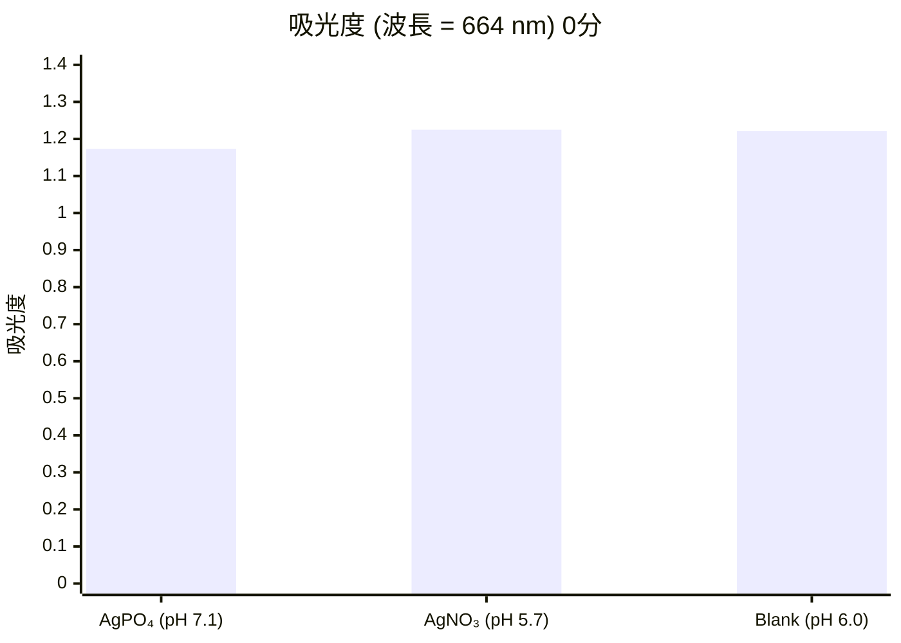
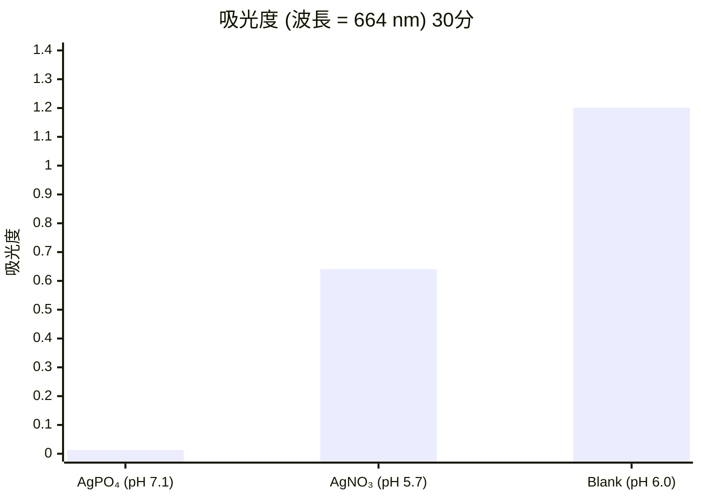
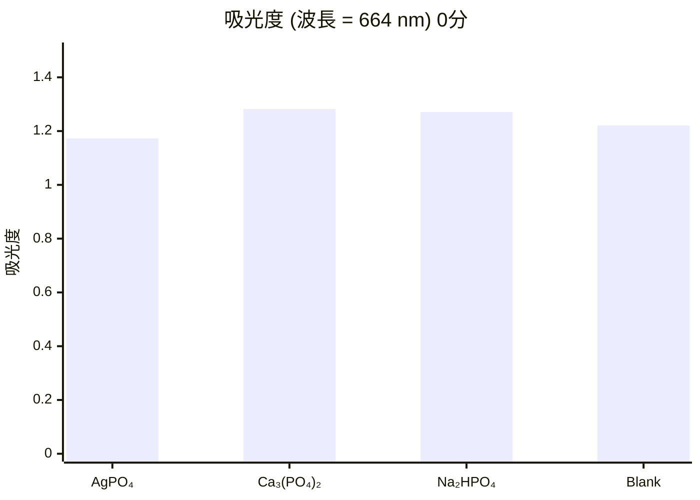
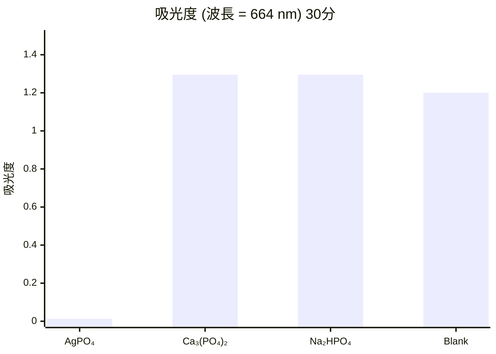

# リン酸銀の光触媒効果について(Photocatalysis of silver phosphate)

*　2451 大阪府立泉北高等学校(Osaka Prefectural Semboku Senior High School )

### 著者  
山本 一貴  
辻 竜大  
井阪 一誠  
菊谷 友暉  

---

## 1. 目的  
現在光触媒として主流である酸化チタンにより、リン酸銀(AgPO₄)が高い光触媒効果を示すことが報告されている。  
本研究では、リン酸銀の光触媒効果を検証するために、銀イオンの検証とリン酸イオンの検証を行った。  
また、AgPO₄の光触媒効果を比較することでその有効性を明らかにすることを目指した。  

---

## 2. 方法  

### 実験1 銀イオンの検証  
メチレンブルー溶液 100 mL (0.004 w%) を3つ用意し、2つにそれぞれ AgPO₄、AgNO₃ (ともに 1.0×10⁻³ mol) を入れ、1つはブランクとして30分間攪拌させた。その後、それぞれ、初期の濃度からの変化を吸光度を用いて比較した。  
- 測定装置: UV-VIS SPECTROPHOTOMETER UV mini 1240 島津製作所  

### 実験2 リン酸イオンの検証  
実験1と同様の条件で、AgPO₄、Ca₃(PO₄)₂、Na₂HPO₄を比較した。  

---

## 3. 結果  

### 実験1  
AgPO₄とAgNO₃ではともにメチレンブルー溶液の濃度は低下するが、その減少速度は、AgPO₄を入れた方が大きかった。  

#### 吸光度 (波長 = 664 nm)  

| 時間 (分) | AgPO₄ | AgNO₃ | Blank |
| --------- | ----- | ----- | ----- |
| 0         | 1.173 | 1.225 | 1.221 |
| 30        | 0.013 | 0.641 | 1.201 |

---

## 実験2
Ca₃(PO₄)₂、Na₂HPO₄では、メチレンブルー溶液の濃度変化は見られなかった。

#### 吸光度 (波長 = 664 nm)

| 時間 (分) | AgPO₄ | Ca₃(PO₄)₂ | Na₂HPO₄ | Blank |
| --------- | ----- | --------- | ------- | ----- |
| 0         | 1.173 | 1.282     | 1.271   | 1.221 |
| 30        | 0.013 | 1.295     | 1.295   | 1.201 |

---

## 4. 考察
実験1では、Ag⁺は光によってAgに還元され、それに伴ってメチレンブルーが酸化分解されたと考えられる。しかし、Ag⁺とPO₄³⁻、それぞれ単独ではAgPO₄ほどの光触媒効果は持っていない。よって、Ag⁺とPO₄³⁻が共存することにより、Ag⁺による酸化分解反応が促進されたと考えられる。

---

## 5. 参考資料
- 独立行政法人 物質・材料研究機構 NIMS  
  [https://www.nims.go.jp/news/press/2010/06/201006070.html](https://www.nims.go.jp/news/press/2010/06/201006070.html)  
- 昭和化学 化学物質安全データシート  
  銀化合物(MSDS)  
- 2010. "An orthophosphate semiconductor with photooxidation properties under visible-light irradiation"  
  *Nature Materials* PUBLISHED ONLINE DOI: 10.1038/NMAT2780