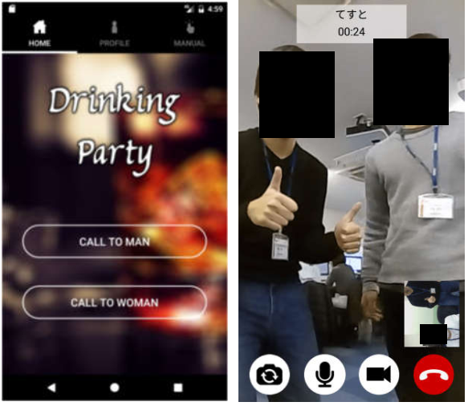

# Drinking Party  
**Team: JJJ**  
**Naoki Tsuda, Yuki Kikuya, Tatsuya Eshiro**  

---

## ABSTRACT  
We developed a random system video-chat application for a lonely person who drinks at home by using Internet Communication.

---

## 1. Introduction  

### 1.1 Research motive  
We wanted to develop the application for killing time because we had developed systematic applications so far.

### 1.2 Research issue  
- Audio & Video Communications by using WebRTC  
- A random match-making system  

---

## 2. Development environment  

### 2.1 Using software  
- Android-Studio  
- MySQL  

---

## 3. Production  

### 3.1 Application abstract  
Development Application for Android Smartphone. A random system video-chat application by using Internet telephone.

---

## 3.2 Conclusion  
We had a difficult time with using and understanding the Android activity Life-Cycle and Asynchronous communication.  

And, our expectations rose for communication technology in the future by understanding the communication system of WebRTC.

---

## 4. Reference  
- SkyWay-Android-Sample  
- SkyWay documents  

---

